# Procesverslag
**Auteur:** -jouw naam-

**De opdrachten:** [opdracht 1](opdracht1/index.html) en [opdracht 2](opdracht2/index.html)

Markdown is een simpele manier om HTML te schrijven.  
Markdown cheat cheet: [Hulp bij het schrijven van Markdown](https://github.com/adam-p/markdown-here/wiki/Markdown-Cheatsheet).

Nb. De standaardstructuur en de spartaanse opmaak van de README.md zijn helemaal prima. Het gaat om de inhoud van je procesverslag. Besteedt de tijd voor pracht en praal aan je website.

Nb. Door *open* toe te voegen aan een *details* element kun je deze standaard open zetten. Fijn om dat steeds voor de relevante stuk(ken) te doen.

## Bronnenlijst
  1. https://codepen.io/paolocavanna/pen/qNKryX
  2. https://dlo.mijnhva.nl/d2l/home/437107
  3. https://youtube.com
  4. https://google.com
  5. http://sortablejs.github.io/Sortable/

## Opdracht 1 plan

  
uitwerken na schetsen idee (voor week 2)

  ### Je storyboard:
  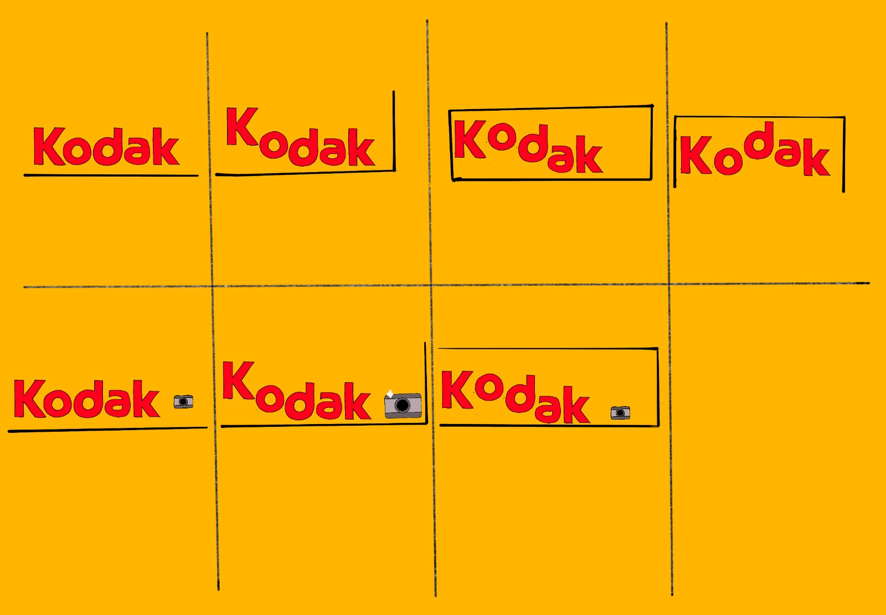

  ### Je ambitie: 
  Aan deze technieken/punten wil ik werken:
  - Aan animatie in het algemeen aangezien ik nog nooit heb geanimeerd op een andere manier dan :hover met HTML/CSS
  - Dat de animaties soepel lopen en een goede timing hebben
  - Het lijkt me leuk om content toe te voegen met ::before en ::after
  - Content zelf maken zonder een foto oid te gebruiken
 

 
 ## Feedback opdr 1:

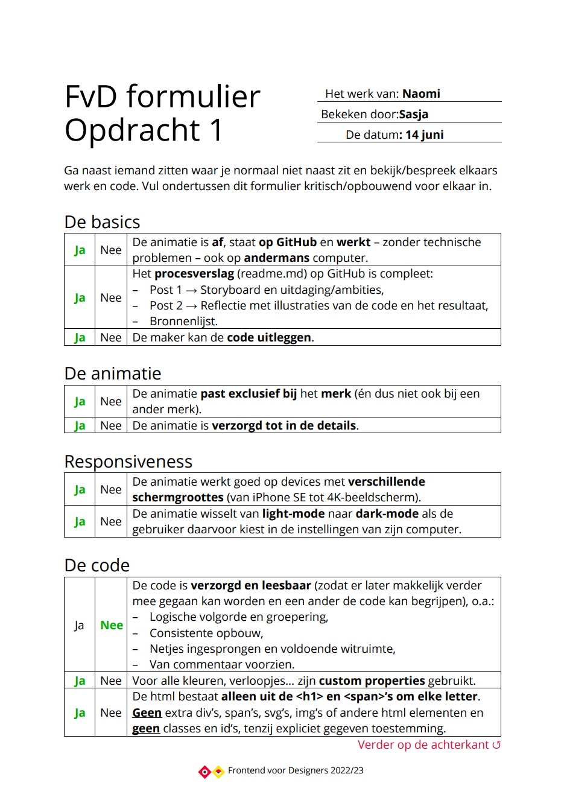
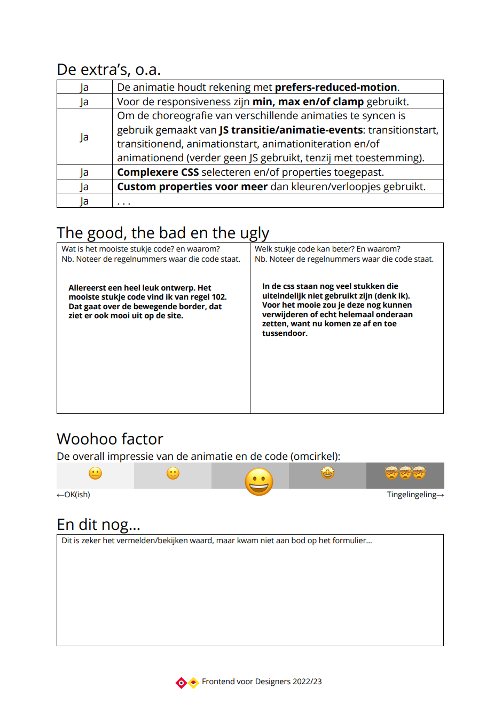

## Opdracht 1 reflectie

  
uitwerken bij afronden opdracht (voor week 4)

  ### Je uitkomst - karakteristiek screenshot(s):
  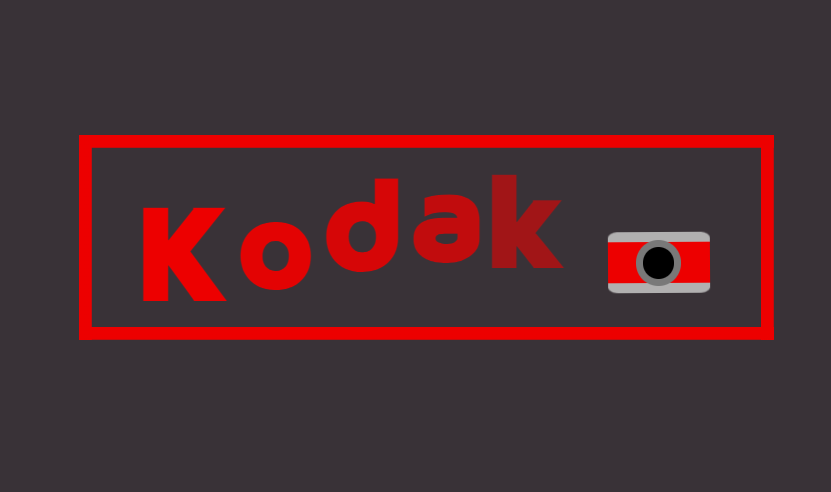

   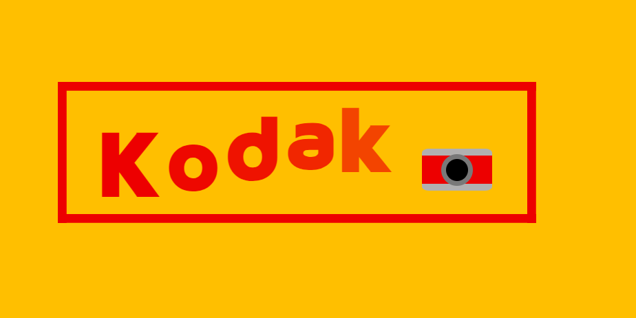

  ### Dit ging goed/Heb ik geleerd: 
  Korte omschrijving met plaatje(s)

  Het maken van de animaties met de keyframes vond ik wel leuk, dit is uiteindelijk ook wel goed gegaan. Ook ben ik blij met de camera die ik heb gemaakt.
  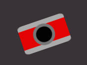
  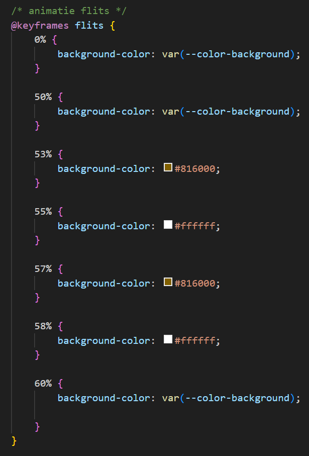

  ### Dit was lastig/Is niet gelukt:
  Het is (voor mij) erg moeilijk om een animatie te maken met een visueel element wat niet het woordmerk is zonder 'div'. De camera kon ik helaas niet maken zonder een div te gebruiken. Ook vond ik het in het algeheel erg lastig maar ben toch wel blij met het eindresultaat.

## Opdracht 2 plan

  
uitwerken na schetsen idee (voor week 5)

  ### Je ontwerp:
  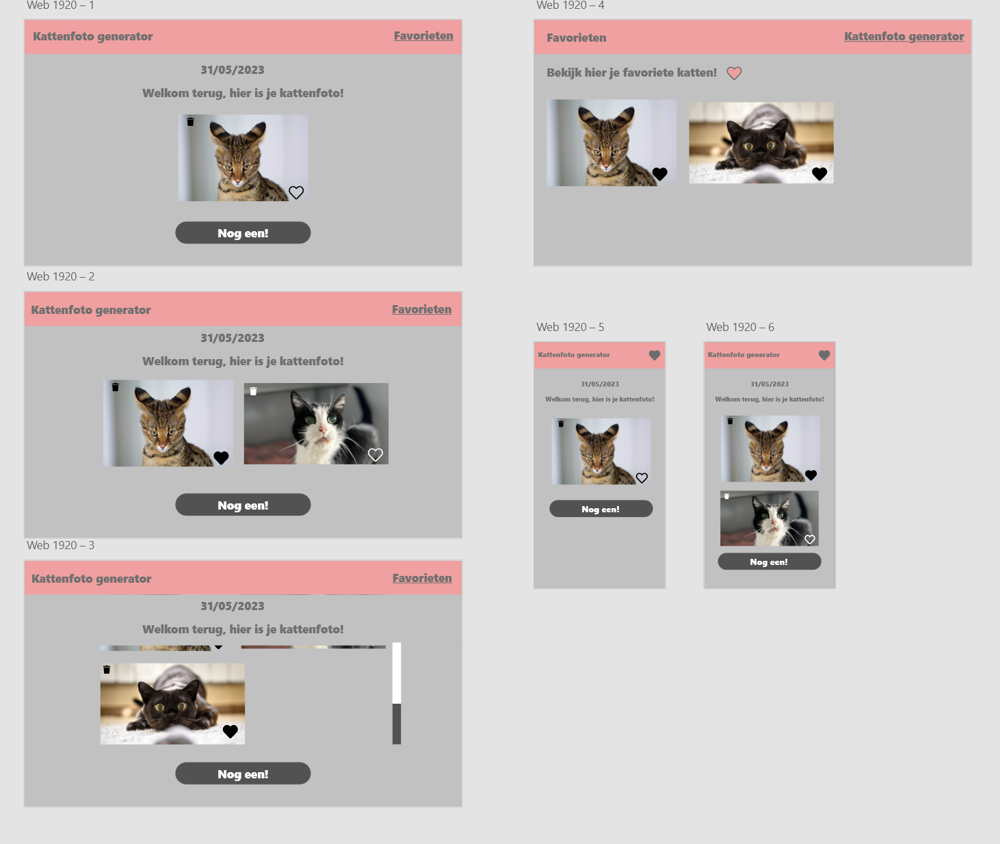

  ### Je ambitie: 
  Aan deze technieken/punten wil ik werken:
  - Ik zou graag willen leren om een interactieve en reactieve site te maken met html/css/javascript
  - Ik moet ook een beetje aan mijn javascript skills werken
  - Het lijkt mij erg leuk om een API te gebruiken

## Opdracht 2 test

  
uitwerken na testen (week 7)

  Neem minimaal 5 bevindingen op:

  ### Bevinding 1:
  De grid van mijn site is nog niet helemaal goed, er is geen spacing tussen de foto's en hierdoor lijkt het geheel rommelig.

  #### oplossing:
  De waardes in mijn grid aangepast

  ### Bevinding 2:
  De foto's kon ik naar een favorietenlijstje schuiven, je kan alleen 100x dezelfde foto aan je favorieten toevoegen en ze er ook weer terugslepen naar de andere  foto's. 

  #### oplossing:
  Ik heb de code uit de library 'Sortable JS' aangepast en daarna werkte het naar behoren.

  ### Bevinding 3:
  De foto's kunnen niet uit het lijstje verwijderd worden. 

  #### oplossing:
  Door een onclick event op de images te zetten kan je nu de foto's van de pagina en uit je favorietenlijstje verwijderen.

  ### Bevinding 4:
  De styling is niet mooi en het lettertype is ook niet aantrekkelijk.

  #### oplossing:
  Ik ben een tijd aan de slag gegaan met css waarvan ik vind dat dit opgelost is.

  ### Bevinding 5:
  Er zit nog geen dark mode in de site

  #### oplossing:
  Deze heb ik toegevoegd met css

## Feedback opdr 2:
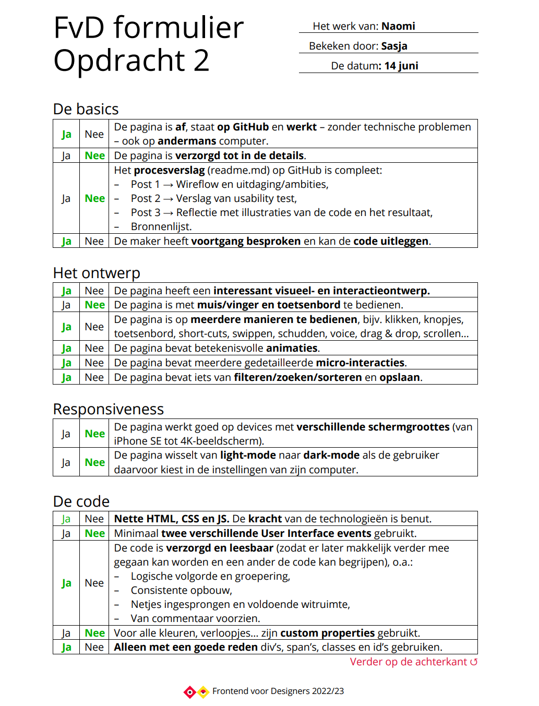
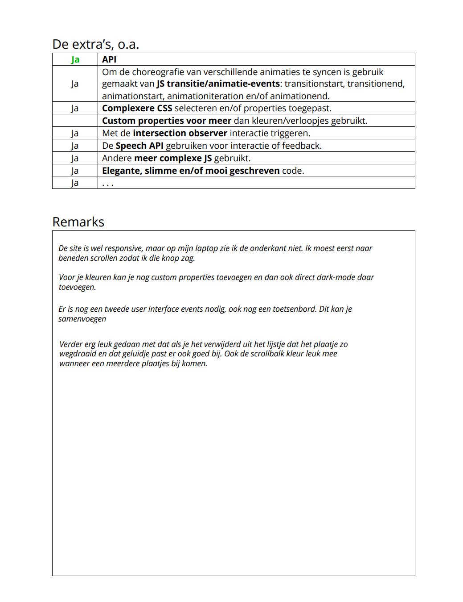

## Opdracht 2 reflectie

  
uitwerken bij afronden opdracht (voor week 8)

  ### Je uitkomst - karakteristiek screenshot(s):
  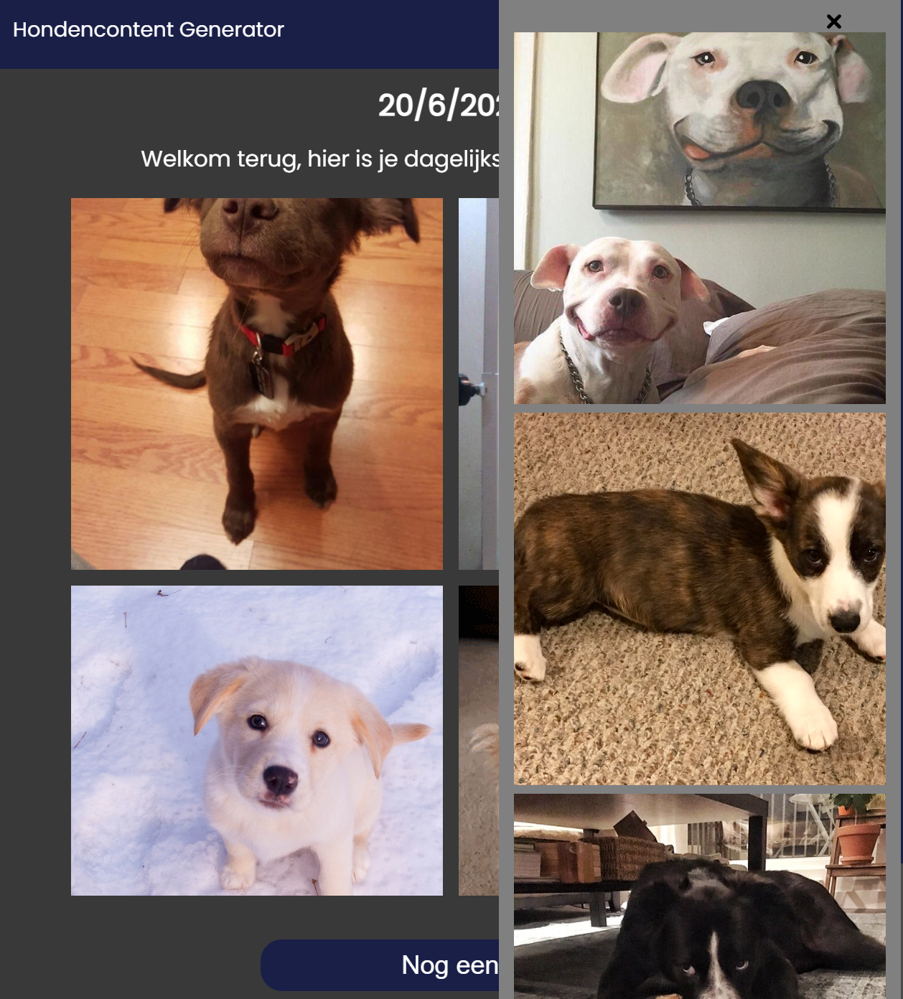

  ### Dit ging goed/Heb ik geleerd: 

  Ik heb uiteindelijk toch een dropdown gemaakt waarin de favorieten tevoorschijn komen, ik dacht dat dit te moeilijk was maar het is me toch gelukt. Ook ben ik trots op de javascript die ik heb geschreven terwijl ik eigenlijk helemaal ervaring heb met js.
  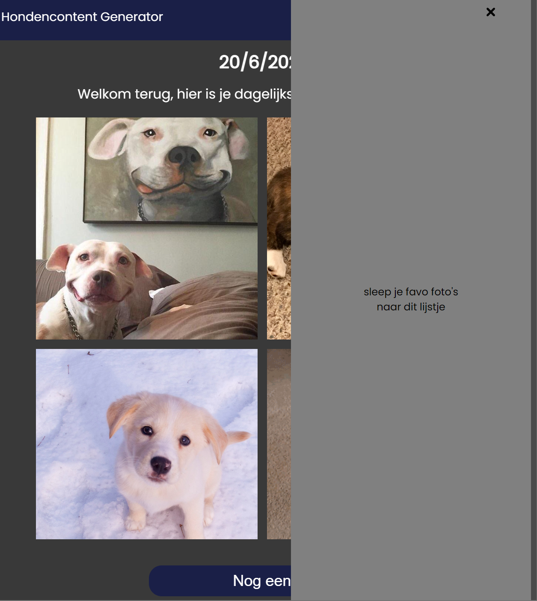
  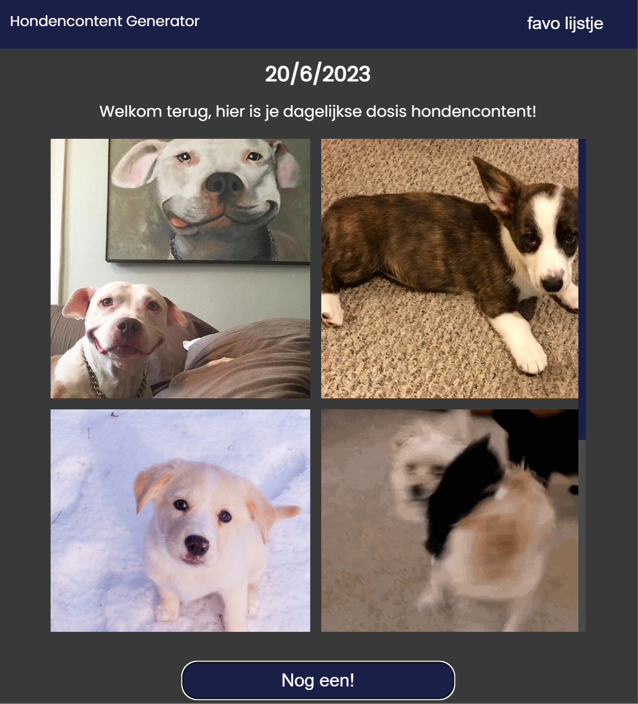

  ### Dit was lastig/Is niet gelukt:
  Er zijn helaas wel een aantal dingen die me in de tijd niet gelukt zijn om nog toe te voegen aan de site, zoals extra microinteracties en animaties. Hier ben ik helaas niet aan toegekomen.

